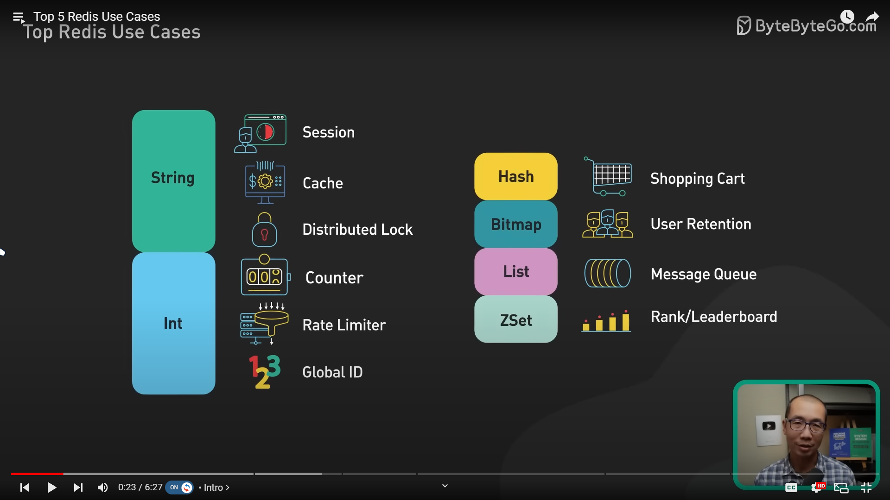
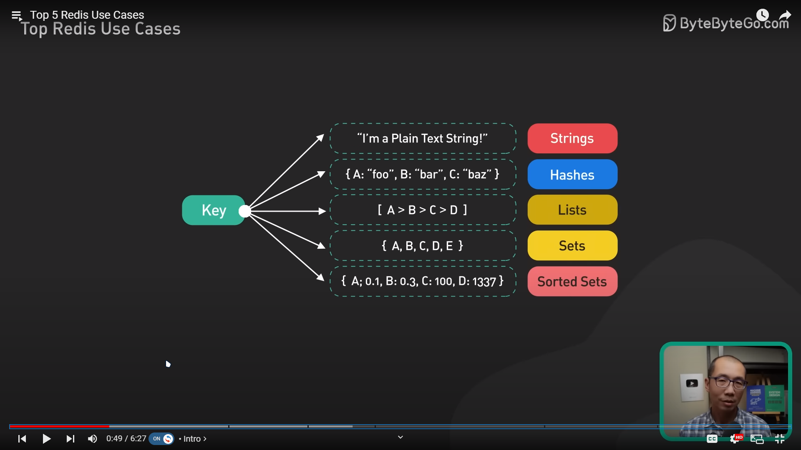

# redis memory handling DB‼️

initial 6 minutes intense video, with **Sahn Lam**

REDIS ROADMAP [first video](https://www.youtube.com/watch?v=a4yX7RUgTxI&list=TLPQMjAwOTIwMjN3tYPxKrlbug&index=1&pp=gAQBiAQB)

redis is a in memory data structure store, it's most commonly used as a **cache**!

redis supports many data structures as:

1. Strings
2. Hashes
3. Lists
4. Sets
5. Sorted Sets



It's known for speed! mentor made a video titled with: why redis is so [fast](https://www.youtube.com/watch?v=5TRFpFBccQM&list=TLPQMjAwOTIwMjN3tYPxKrlbug&index=2&pp=gAQBiAQB)

## Top used cases‼️

1. caching objects to speed up web applications
2. setting a correct TTL(time-to-live) & Thundering herd
3. session storing, same as Sanjeev did in his course!
4. distributed log
5. rate limiter, it increments user_id req n, to count it!🟢
6. gaming Rank/leaderBoard

we can persist data used in redis with AOF, Snapshot, but these methods in often take to long to load to be particle

In production **replica** is used instead, as **backup instance** with redis!

it can be **distributed log**, tough to understand his approach here🥵

Mentor says, redis is **very versatile**

---

2nd course‼️ from [web dev simplified](https://youtu.be/jgpVdJB2sKQ?list=TLPQMjAwOTIwMjN3tYPxKrlbug)‼️

mentors says, by the end of the 27m lecture, he'll be able to **speed his app up** by about 10 to 15 times only with redis added to it!

to install redis in ubuntu, use this command: `sudo apt-get install redis`, then type: `redis-server` to start it,then to access our DB use `redis-cli`.

its commands are case insensitive. people use uppercase

main objective in this redis course, is setting values and getting them from redisDB

```sh
redis-cli
SET name kyle
# name is a key, kyle is its value
GET name
# it brings "kyle"
SET age 25
GET age
# it brings "25"
DEL age
GET age
# stout (nil) => nullish
EXISTS name
# it'll check if name exists, if true => 1, if nil => 0
KEYS *
# brings all stored keys
flushall
# flushall removes all stored data!
ttl name
# outputs the time to live of name, -1 => no expiration, set for keeps
expire name 10
# that makes it expire in 10 seconds, when it becomes -2 => gone

# to set expiration while setting the key value, do:
setex key_yo 10 value_yo
# ttl key_yo if you wanna recheck maxAge
```

redis stores init as string, it can understand it's a digit, but handling it with apps is better, he's said

If we wanna add an item to the list, we use this command:

```sh
lpush friends john
# that adds an item to 0th of the list, => left push
# get doesn't work with that list, so we use lrange
lrange friends 0 -1
# that brings up friends list from indexes from 0 to last one

# let's add another list item, r => right push, so it append it, and l prepend it:
rpush friends sally
# lpop && rpop removes items from list!
LPOP friends
# that removes "john"
```

we can use those methods to view last 5 most recent messages from a client, in a messaging app! rpop and lpop letting only 5 to stick

Sets, same as JS sets, unique value array!

we prepend S before array commands, as SADD for add;

```sh
SADD hobbies "weight lifting"
# hobbies is the key of Set() "weight lifting" is the value
SMEMBERS hobbies # this returns set.values
SREM hobbies "weight lifting" # this removes it
```

Hashes! we can think of them as **key value pair** inside another **key value pair**

we prefix every command with an H for hashes!

```sh
HEST person name kyle
HGET person name
# it returns: "kyle"
HGETALL person
# this brings keys and values of person hash

HDELL person age
# this removes the age key and its value in {person hash}
HESITS person name # checks with 0 || 1 condition
```

## steps with node app

```sh
npm i redis
```

```js
const Redis = require('redis')
const redisClient = Redis.createClient()// this is the default

const redisClient = Redis.createClient({
  url: //this is the production, so I need it
})

app.get('/photos', async (req, res) => {
  redisClient.setex('key', maxAge,'value') // this is where we use the commands we learned as set setex etc.
  // rest of code
  // if we're having a js array, we should stringify it to json => JSON.stringify()
  // so mentor stored 3500 lines of json in that stringified data, and will use it from memory on behalf of hard drive
})
```

So, we use redisClient.get('key',CB Fn)
we add this get verb before setex, to check if our data exists in memory, as for first time, to cache it for future requests! as:

```js
redisClient.get('key', (err, keyData) => {
  if (err) console.error(err)
  if (keyData != null) res.json(keyData)
})
```

So, his final caching data app is as:

```js
const Redis = require('redis')
const redisClient = Redis.createClient({
  url: //prod requirement
})

app.get('/photos', async (req, res) => {
  redisClient.get('key', (err, keyData) => {
    if (err) console.error(err)
    if (keyData != null) res.json(keyData)
  })

  redisClient.setex('key', maxAge,'value')
})
```

watch this: 
